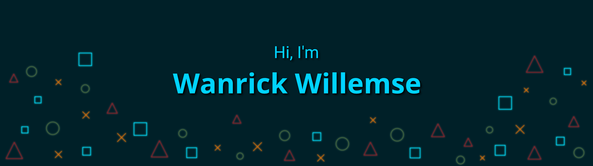

# :chart_with_upwards_trend: My Github Stats

<table align="center">
    <tbody>
        <tr align="center" style="border:none;">
            <td align="center" style="border:none;">
               
              
              
            </td>
            <td rowspan=2 style="border:none;">
              
            </td>
        </tr>
        <tr style="border:none;">
            <td style="border:none;background-color:white;">
              
            </td>
        </tr>
    </tbody>
</table>

# 💼 Skills

  
Things I dabble in

  
  
  
  
  

  
  

  
  

<!-- 

# Projects
// Add things here
 -->
